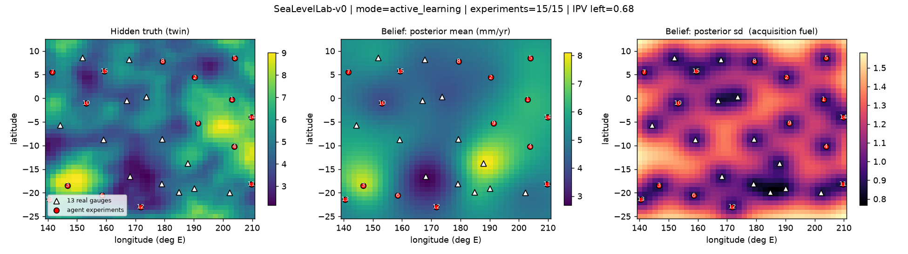
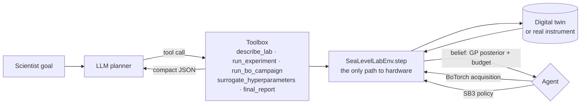

# SeaLevelLab

**The intelligence layer of a self-driving laboratory, built on a Bayesian spatial model of Pacific sea-level rise.**

[](https://github.com/yanlong-iao/SeaLevelLab/actions/workflows/ci.yml)
[](ai4s/requirements.txt)
[](flood_ai4s.qmd)
[](LICENSE)
[](https://yanlong-iao.github.io/SeaLevelLab/)

**Interactive query app:** [docs/app.html](https://yanlong-iao.github.io/SeaLevelLab/app.html) — a pan-and-zoom map of the tropical Pacific with the exceedance-probability field, P(annual maximum sea level exceeds this station's own 1-in-N baseline level), painted over it for any year 2000–2100 and baseline return period. Click any location and a panel slides in with the probability, its 90 % credible interval, a local 3D surface (±6° × ±5°), data support and the nearest gauge; click a gauge for its annual maxima and fitted GEV return-level curve. Non-stationary GEV on de-trended annual maxima; R computes, the page is static (only the basemap tiles are fetched).

A tide-gauge network *is* a laboratory whose experiments are expensive: deploying a gauge or running a
survey campaign at a location. This project takes a classical R-INLA / SPDE spatial model of monthly sea level
at 13 Pacific stations (1992–2025) and turns it into the decision layer an autonomous lab needs:

| Layer | What it does | Stack |
|---|---|---|
| **Digital twin** | Ground-truth rise-rate field drawn from a Matérn GP fitted to the 13 real gauges; `measure(x)` is the physical experiment | numpy · scipy |
| **Environment** | `SeaLevelLab-v0`: a belief-MDP where the state is the GP posterior, the action is *where to experiment next*, the reward is information gain or improvement | **Gymnasium** |
| **Closed loop** | Refit surrogate → acquisition (integrated posterior variance / noisy EI) → experiment → Bayes update | **BoTorch** · Optuna |
| **Learned policy** | Amortised experimental-design policy trained across many hidden truths | **Stable-Baselines3** PPO |
| **Agentic layer** | An LLM scientist reasons over compact statistics and calls the lab through audited tools (ReAct); offline mock + live agent against any OpenAI-compatible endpoint | OpenAI function calling · `ellmer` |
| **Live demo** | Everything re-implemented in R with interactive 3D surfaces and an animated belief map, rendered in RStudio | R-INLA · plotly · R6 |

<p align="center"></p>

*One active-learning episode. Left: the twin's hidden truth. Middle: the belief after 15 experiments. Right: posterior sd,
the quantity every acquisition function integrates. Triangles are the 13 real gauges; numbered red points are the experiments
the loop chose.*

## Why a statistician built it this way

The SPDE field in the original model and the GP surrogate inside a Bayesian-optimisation loop are the **same
mathematical object** (Lindgren, Rue & Lindström 2011): `alpha = 2` in R-INLA is a Matérn kernel with ν = 1, INLA's
`int.strategy = "eb"` is the type-II maximum likelihood that `fit_gpytorch_mll` performs, and the posterior-sd map the
original analysis plotted is the fuel of UCB, EI and integrated-variance acquisitions.

Three things a statistics background catches that an ML default gets wrong, all visible in the code:

- **Identifiability.** With 13 sites the Matérn range and the nugget are only jointly identifiable (Zhang 2004). Maximum
  likelihood collapsed the surrogate to a 0.3° range and zero noise; log-normal priors (MAP-II, the analogue of INLA's PC
  priors) fix it. See `fit_hyperparameters` in [`ai4s/sea_level_twin.py`](ai4s/sea_level_twin.py).
- **Calibration.** Mis-calibrated posterior sd mis-prices every acquisition; the calibration check is a first-class diagnostic.
- **Design of experiments.** The active-learning reward is the A-optimal criterion; the agent's stopping rule is
  *information gain per experiment*, not a fixed schedule.

## Results

`python ai4s/run_demo.py --budget 15 --episodes 6 --rl-steps 40000` — same hidden truths and measurement noise for every agent.

**Active learning** — fraction of prior map variance remaining after 15 experiments (lower is better)

| agent | IPV remaining | best measured (mm/yr) |
|---|---|---|
| Random | 0.815 ± 0.045 | 6.84 |
| SB3-PPO | 0.957 ± 0.000 | 5.64 |
| BoTorch | 0.682 ± 0.002 | 8.18 |

**Optimisation** — simple regret vs. the twin's true maximum, mm/yr (lower is better)

| agent | simple regret | best measured (mm/yr) |
|---|---|---|
| Random | 2.456 ± 1.741 | 6.84 |
| Optuna-GP | 2.294 ± 0.620 | 7.01 |
| SB3-PPO | 3.984 ± 0.438 | 5.93 |
| BoTorch | 1.719 ± 0.483 | 7.32 |

The closed loop removes 32 % of the map uncertainty where random experimentation removes
18 %, with a spread across truths four times smaller. Cold-start hot-spot search with 15 noisy
experiments is genuinely hard and the regret numbers overlap. PPO at 40k steps has not learned a competitive policy, which is the
standard finding for small-budget experimental design and is reported rather than hidden.

## Architecture



## Quick start

**Python stack**

```bash
cd ai4s
python -m venv .venv && source .venv/bin/activate
pip install -r requirements.txt
python sea_level_env.py        # Gymnasium check_env + a random rollout
python run_demo.py             # Random vs BoTorch vs Optuna vs PPO benchmark, figure, agent transcript  (~3 min)
python run_demo.py --live      # let an LLM drive the lab (OPENAI_API_KEY, or OPENAI_BASE_URL for vLLM / Ollama)
pytest tests                   # 8 smoke tests, also run in CI
```

**RStudio live demo** — open [`flood_ai4s.qmd`](flood_ai4s.qmd) and press *Render* (INLA, plotly, R6, reticulate, ellmer).
The rendered result is served at **https://yanlong-iao.github.io/SeaLevelLab/** and the five-phase engineering write-up
(math bridge, MDP design, agentic workflow, benchmark, interview pitch) at **https://yanlong-iao.github.io/SeaLevelLab/report.html**.

## Repository layout

```
├── flood_final.qmd          original R-INLA SPDE analysis (the "before")
├── flood_ai4s.qmd           RStudio demo: INLA → GP → twin → Gym-style env → BO loop → LLM agent, 3D plotly
├── R/gp_core.R              shared Matérn GP core (k_matern, gp_post, gp_post_diag, gp_fit) used by the qmd and the app
├── app/build_app.R          joint GEV MLE (shared xi), GP fields for trend and log-scale, IPV site, self-checks → docs/app_data.js + docs/vendor/
├── app/test_app_math.js     node gate for the browser-side formulas (baseline check, monotonicity, band order, raster y-flip)
├── Processed_Final_data.csv 13 Pacific tide gauges, monthly, 1992–2025
├── ai4s/
│   ├── sea_level_twin.py    data → rise rates → Matérn GP (MAP-II) → hidden-truth sampler → measure()
│   ├── sea_level_env.py     SeaLevelLab-v0 (Gymnasium): belief-MDP, two reward modes, render, discrete wrapper
│   ├── bo_agent.py          BoTorch loop (qNegIntegratedPosteriorVariance / qLogNoisyEI) + Optuna + random baseline
│   ├── rl_agent.py          Stable-Baselines3 PPO on the same environment
│   ├── llm_agent.py         @tool toolbox, mock ReAct agent, live agent (OpenAI-compatible function calling)
│   ├── run_demo.py          benchmark + figure + transcript
│   ├── tests/               smoke tests (Gymnasium contract, every agent closes the loop, tool guards)
│   └── outputs/             results.json, belief_map.png, agent_transcript.txt
└── docs/                    GitHub Pages: rendered demo (index.html), report (report.html), query app (app.html + app_math.js + app_data.js + vendor/)
```

## Data

Monthly sea-level statistics from the Pacific Sea Level and Geodetic Monitoring Project (Australian Bureau of Meteorology),
13 stations: Cook Islands, Fiji, Federated States of Micronesia, Kiribati, Marshall Islands, Nauru, Niue, Papua New Guinea,
Samoa, Solomon Islands, Tonga, Tuvalu, Vanuatu. `Mean` is relative to each gauge's own datum, so the comparable physical
target used throughout is the **rise rate** (trend + annual cycle fit per station), 1.5–9.8 mm/yr.

## References

- Lindgren, Rue & Lindström (2011). An explicit link between Gaussian fields and Gaussian Markov random fields: the SPDE approach. *JRSS-B*.
- Zhang (2004). Inconsistent estimation and asymptotically equal interpolations in model-based geostatistics. *JASA*.
- Balandat et al. (2020). BoTorch: A framework for efficient Monte-Carlo Bayesian optimization. *NeurIPS*.
- Letham et al. (2019). Constrained Bayesian optimization with noisy experiments. *Bayesian Analysis*.
- Yao et al. (2023). ReAct: Synergizing reasoning and acting in language models. *ICLR*.

## License

MIT
